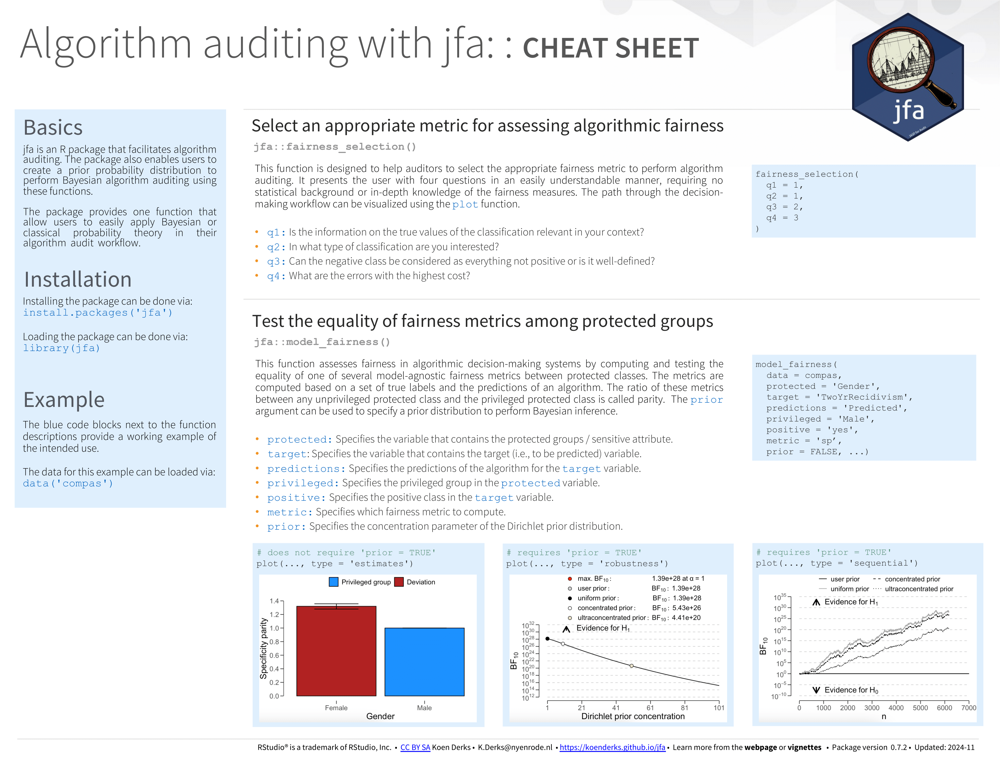

```{r, include = FALSE}
library(jfa)
```

## Introduction

Welcome to the 'Algorithm auditing' vignette of the **jfa** package. This page
provides a guide to the functions in the package that are designed to facilitate
the audit of algorithms and predictive models. In particular, these functions
implement techniques for determining an appropriate fairness measure and
subsequently calculating and testing algorithmic fairness using this measure.
The package also allows users to specify a prior probability distribution to
conduct Bayesian algorithm auditing using these functions.

## Functions and intended usage

Below you can find an explanation of the available algorithm auditing functions
in **jfa**.

- [`fairness_selection()`](#selecting-a-fairness-measure)
- [`model_fairness()`](#testing-algorithmic-fairness)

### Selecting a fairness measure

The `fairness_selection()` function is designed to help auditors to select the
appropariate fairness metric to perform algorithm auditing. The questions within
the decision-making workflow are based on observable data characteristics, the
properties of fairness measures and the information required for their
calculation. However, these questions are posed to the user in an easily
understandable manner, requiring no statistical background or in-depth knowledge
of the fairness measures. The function returns an object that can be used with
associated `print()` and `plot()` methods.

For additional details about this function, please refer to the
[function documentation](https://koenderks.github.io/jfa/reference/fairness_selection.html)
on the package website.

*Example usage:*

```{r}
# Workflow leading to accuracy parity
fairness_selection(q1 = 1, q2 = 1, q3 = 2, q4 = 3)
```

### Testing algorithmic fairness

The `model_fairness()` function is designed to evaluate fairness in algorithmic
decision-making systems. It does this by computing and testing the equality of
various model-agnostic fairness metrics between protected classes, based on a
set of true labels and the predictions of an algorithm. The ratio of these
metrics between an unprivileged protected class and a privileged protected class
is referred to as parity, which quantifies relative fairness in the algorithm's
predictions. Available parity metrics include predictive rate parity,
proportional parity, accuracy parity, false negative rate parity, false positive
rate parity, true positive rate parity, negative predicted value parity,
specificity parity, and demographic parity [@friedler_2019; @pessach_2022]. The
function returns an object that can be used with the associated `summary()` and
`plot()` methods.

For additional details about this function, please refer to the
[function documentation](https://koenderks.github.io/jfa/reference/model_fairness.html)
on the package website.

*Example usage:*

```{r}
# Compare predictive rate parity
x <- model_fairness(
  data = compas,
  protected = "Ethnicity",
  target = "TwoYrRecidivism",
  predictions = "Predicted",
  privileged = "Caucasian",
  positive = "yes",
  metric = "prp"
)
summary(x)
```

## Benchmarks

To ensure the accuracy of statistical results, **jfa** employs automated
[unit tests](https://github.com/koenderks/jfa/tree/development/tests/testthat)
that regularly validate the output from the package against the following
established benchmarks in the area of algorithm auditing:

- [fairness](https://cran.r-project.org/package=fairness) (R package version 1.2.2)

## Cheat sheet

The cheat sheet below will help you get started with **jfa**'s algorithm audit
functionality. A pdf version can be downloaded [here](https://github.com/koenderks/jfa/raw/development/man/figures/cheatsheet/cheatsheet-algorithm.pdf).

<p align='center'></p>

## References
<div id="refs"></div>
